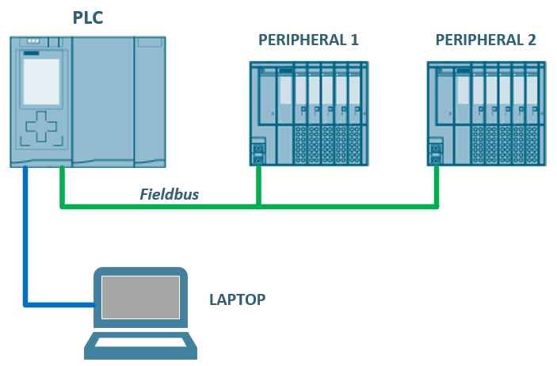
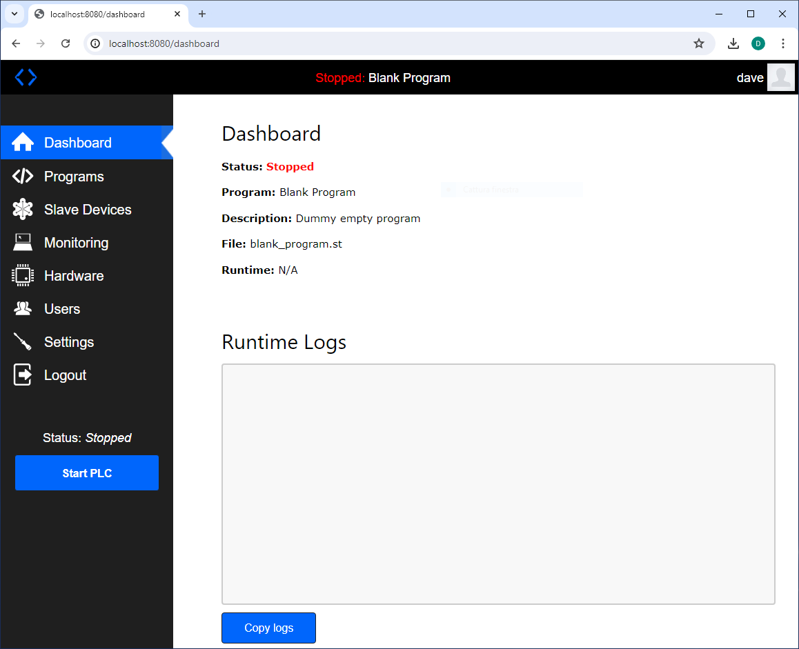
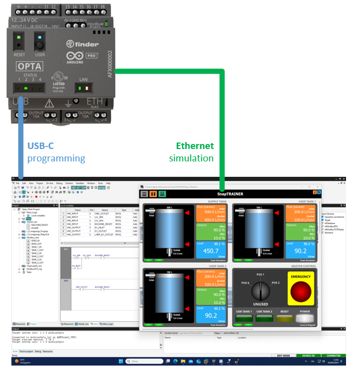

# SnapTRAINER

Welcome to the fantastic world of **industrial automation**.
The aim of this project is to allow everyone to learn to program PLCs at no or very low cost.

To do this, however, we need a trainer to help us debug our programs and we need to identify zero/low-cost platforms to use.

**Find everything here.**

If the project is of interest to you, you can find some other information in the article I wrote.

Follow <a href="https://www.linkedin.com/in/davidenardella/" target="_blank">me on Linkedin</a> to stay updated on this project and others of the same type.

When we create control software with a PLC we need to test it.

Suppose we have written the control software for one of our stations which is part of an automatic production line and which, among other things, contains some pneumatic cylinders; the program convinces us but now we have to try it (Later you will see what a pneumatic cylinder is and how it works).

We almost certainly don't physically have the station, so we decide to organize ourselves with the typical peripherals present in traditional trainer kits, i.e. switches and buttons connected to the I/O of the PLC.

Well, to simulate a single cylinder we need two inputs and two outputs.

How do we organize ourselves for the cycle? Simple, when we observe the LED that simulates the extension valve turning on, we wait a few seconds and then activate the switch that simulates the extended cylinder sensor and vice versa.

Ok, but what do we do for six or eight cylinders? Which constitute little stuff for a real station.

And what if we also need to manage start/stop buttons and lamps?

Assuming we have sufficient I/O, we will be completely focused on controlling the LEDs and operating the various switches, leaving out the most important part: our program.

**In practice we find ourselves unable to manage the testing of an automation that is even too banal.**

---

**SnapTRAINER** is a modular Virtual PLC-Trainer that allows us to free ourselves from these problems; it allows us to simulate external hardware through the use of specific intelligent modules.

It is a **64-bit** application for Windows (W7/W10/W11).

The name follows a bit of a tradition of mine; first I wrote **Snap7**, a cross-platform library for communication with Siemens PLCs, later I produced **SnapMODBUS**, also cross-platform to handle Modbus communication, so it seemed appropriate to call the simulator SnapTRAINER.

On github you can find the manual organized by modules, suitable for expansion. I give here a summary explanation and philosophy of operation. 

SnapTRAINER consists of a virtual switchboard containing 24 slots divided over 8 DIN rails, in each slot a virtual module selected from a list can be housed.

The list is compiled at the start based on the libraries present (each module is a DLL); in the future, once other DLLs for new modules are created, they will automatically be included in the list. 

Each module simulates a component or group of components and communicates with the PLC by reading and writing registers.

Once a module is inserted into a slot, opening its context menu will show four options.
* **Remove** Module to delete the module. 
* **Change Module caption** to change the instance name (in the figure "MAIN TANK"). 
* **Exchange with slot Number... to** exchange the module with the one in the selected slot (or simply to move it if the destination slot is empty). 
* **Settings** which will open the instance parameter editing window. 

I better specify the concept of instance.
When we insert a new module, we are going to create a room of the selected family; we can insert multiple modules of the same family, for example, eight digital I/O modules; each one will behave the same way, but will have its own parameters distinct from those of the other modules.

The set of modules with their parameters, their arrangement on the control cabinet and the general communication parameters constitutes a **SnapTRAINER Project**, which can be saved and reloaded in the future via the main menu.

Such a project is a **single file**; an appropriate place to store it is in the project folder of the PLC referred to.

Still with the main menu we can create a new project or save the current one under another name and/or in another folder, as well as activate the communication parameterization window.

Finally, the **Play** button starts the simulation and thus physical communication with the PLC, and the Pin button, the blue one in the upper right, allows you to keep the application in the foreground at all times, which is very convenient if you have only one PC with which you do both programming and simulation.

 
## Communication

Each module, in order to work, needs to exchange bits or values with the PLC, these are organized in **16-bit Registers** that are **completely generic**, in fact, the modules do not know the PLC or the communication modes, they read and write in an internal SnapTRAINER area; the internal multiprotocol communication processor will take care of transferring data to and from the PLC.

Communication with the PLC therefore is not simulated, but **real**. Two protocols are available: Modbus (managed by SnapMODBUS libraries) and S7 (managed by Snap7).

By selecting Modbus, you can choose between Modbus/TCP (Ethernet-based) or Modbus/RTU (via RS485 or RS232). In either case, SnapTRAINER can be configured as either **Master** or **Slave**. 

To select the type of communication, you will actually often want to start in the right-hand column; that is, determine what protocol and mode are supported by your PLC and select the SnapTRAINER mode accordingly.

Let us now look at the various communication patterns, but first some important notes:

* When we talk about Modbus the discussion is to be understood indifferently for TCP and RTU.
* All management of data transfer between the internal area and the modules and between the internal area and the PLC is **completely transparent**; we mention this for completeness, but **you will not have to deal with it directly.**
* In case of communication failures, SnapTRAINER **automatically** handles the reconnection; thanks to a feature of the Snap7 and SnapMODBUS libraries, this is very fast and does not suffer from the TCP delay in case of an absent partner; in fact, first a PING (which is very fast) is performed and then, if successful, the TCP connection is made.   Even by disconnecting and reconnecting the network cable, the system generally reconnects in 500 ms.

#### Modbus: SnapTRAINER Master - PLC Slave 

In this mode, SnapTRAINER is the active partner, connecting to the PLC and using Modbus functions 3 and 4 to exchange data; registers are transferred one at a time, both because SnapTRAINER does not know the sequencing a priori but mainly because not all PLCs handle multiple transfers.

The dashed arrows indicating the transfer from the Register Pack to the modules is handled by the modules themselves.

In the parameterization window we will select Master as the Mode and Modbus TCP or Modbus RTU as the protocol. The address is that of the PLC, the default port is the Modbus port but you can change it if necessary.

Unit ID is the Modbus identifier (the Slave ID), in Modbus TCP it should not make sense; however, check the specifications of your PLC, for example, Arduino OPTA requires this to be 255.

Refresh time indicates the refresh time expressed in milliseconds.

Let’s talk about the connection-related checkbox.

There are two communication errors, the serious one occurring when SnapTRAINER fails to connect with THE PLC or the PLC closes input connections; this is a critical condition for all modules, and all LEDs will turn red.

The second is an addressing error, that is, we are requesting access to a register that is out of range. In this case, the LED for that register on the module will be yellow.

This Checkbox allows SnapTRAINER to disconnect from the PLC even in the presence of errors of the second type. Sometimes, as a result of a logic error, some PLCs tend to "crash," so a disconnect/reconnect cycle (which occurs automatically) can resolve the situation. 

#### Modbus: PLC Master - SnapTRAINER Slave

In this mode, the PLC is the active partner, connects to SnapTRAINER and uses Modbus 3 and 16 functions to exchange data; registers, if the PLC allows, can be transferred as a group, SnapTRAINER supports this mode.

Again, the dashed arrows indicate the transfer to and from the Register Pack, which is handled directly by the modules.

The parameterization is similar to the previous one; you will obviously have to select the Slave mode.

In this case Address is the address of the PC on which SnapTRAINER runs, and it is the same address you will need to indicate in the PLC parameterization when you go to define the Device.

If you use Modbus TCP, the Slave ID value is indifferent, you can put what you want, in case of Modbus RTU you are going to enter what you have parameterized in the PLC.

Communication, by default, is by reading/writing "Holding Registers." With the Checkbox present, it is possible for the PLC to read the input values as "Input Registers." Some PLCs allow multiple transfer of Input Registers only; if you have performance problems you can use this mode. From the point of view of SnapTRAINER and the modules it is indifferent.

#### S7 Protocol: SnapTRAINER Client - PLC Server

This protocol allows communication with Siemens PLCs to be handled very easily and efficiently.

With the S71200/1500 series PLCs you can also use Modbus; in fact, there are system FBs that handle it. However, I do not recommend this choice, first because you need to call up the FBs, parameterize them, etc. this is not terribly complicated, but if you are a novice it is an unnecessary effort; second because Modbus is handled at the program level, while S7Protocol is handled directly in the firmware by the communication processor, so it is much more efficient; moreover, with S7Protocol there is nothing to do at the program level, only to set some parameters in the communication properties of the PLC (I will show you how to do it in a moment).

For the previous generation PLCs, S7300/400/WinAC the choice is forced: you will have to use S7 Protocol; there are actually Modbus libraries for this series as well but they are chargeable (and a bit annoying to use). So, if you have an old S7300 (equipped with an Ethernet port) salvaged perhaps from some online auction, you can safely use it with SnapTRAINER.

With this protocol SnapTRAINER is always the Client.

To adapt the addressing scheme, SnapTRAINER automatically transforms the number of registers into the address of the WORD within a DB (Data Block) according to the formula shown in the image.

This means that you will have to create a DB within which you can insert, in a very flexible way, either Word variables or bit struct variables, the important thing is that the address follows the formula.

To enable absolute addressing manageable by S7 Protocol, it is critical that for S71200 and S71500 PLCs the DBs are not optimized.

And that GET/PUT access be allowed without a password.

**What pattern to use?**

If you have a **Siemens PLC** the choice is a must, but if you will be using Modbus and your PLC allows you to work both as Master and, as Slave, you will have to decide.

**OpenPLC** (the Windows/Linux runtime) handles both modes well.

**Arduino OPTA** when used as a slave will sometimes disconnect the Master if the refresh rate is a bit high for its liking, also it does not allow multiple transfer of registers. I therefore recommend that you set this PLC as Master and SnapTRAINER as Slave.

The Modbus Slave mode also allows the possibility of having two modules communicate with each other with or without an input connection from a PLC or having multiple PLCs communicate **simultaneously** with SnapTRAINER Slave as it can handle up to 1024 active connections.

## MODULES
Let us now look at the modules available in the first released version.

**Generalities**

All modules consist of a panel and a parameter window.

When SnapTRAINER is offline (i.e., not communicating with the PLC) a button is visible that activates the context menu for deleting, moving, or activating the parameter window.

With SnapTRAINER online, the buttons disappear and the status LEDs (one for each exchanged register) light up to indicate the status of the transfer:

* **Red**: connection problems
* **Yellow**: register addressing problems (probably out of range)
* **Green**: transfer OK.

### Digital I/O module

This module allows 16 input bits and 16 output bits to be exchanged with the PLC.

The upper area is the one dedicated to the inputs (outputs of the PLC), contains 16 LEDs, a display to show the register value in three formats selectable by the buttons below:

* **H**: Hexadecimal (0000..FFFF)
* **D**: Unsigned integer (0..65535)
* **S**: Integer with sign (-32768..+32767)

In addition, there is a bar that graphically represents the input value. 

The lower area is dedicated to outputs (PLC inputs).

* 16 microswitches that allow the output bits to be individually controlled.
* A display showing the value in hexadecimal.
* A bar to represent the value graphically.
* Two buttons, **[Force all OFF]** and **[Force all ON]** that allow you to set all bits simultaneously to zero or one, respectively.
* A hexadecimal keyboard that allows you to set an arbitrary value from 0000 to FFFF and send it to the outputs with the press of the **[OK]** button. This function is useful when we want a set of bits to all arrive at the same time in a given configuration. The small display above the [OK] button will show the set value as it is typed.

This module occupies two registers, one read and one write.

Its parameterization page is as follows:

 
This module supports **immediate write** mode, which can be activated through the CheckBox in the digital outputs section.

Immediate write provides that the value of the outputs is sent **instantaneously** to the PLC with each change, without going through the cyclic communication thread. This can make the PLC program more responsive.

If SnapTRAINER is set as **MODBUS Slave**, this option is not active, as the PLC decides how and when to exchange data.

 
### Analog Input Module

This module allows two channels to be displayed and consider the input values as 16-bit ADC (Analog to Digital Converter) points.

A real-time graph allows us to visualize the progress of values over time.

Let’s look at the parameterization right away to understand how visualization occurs.

There are two pages, one for each channel, and they are identical, so we analyze only one.

The values of an ADC are expressed in points. However, we are interested in displaying the value of the physical quantity associated with these points.

To do this we need to convert our points to a real (floating point) value, for example, the number 3470, associated with a thermocouple tells us little, it makes much more sense to display 21.7 °C.

Assuming that our sensors are linear (this is the case today; many years ago, when I started in automation, it was necessary to linearize the ADC points with a linear regression), to convert the points we use the equation of the line: **y=mx+n**.

That is, **Actual value = Slope * ADC points + Intercept** 

So, we need to calculate the Slope (slope of the line) and Intercept (point where the line intersects the Y axis).

This calculation SnapTRAINER does automatically by calculating coefficients from two points.

Basically, considering a diagram where on the X axis are the ADC points and on the Y axis are the real values, what we will need to provide are minimum and maximum points and their corresponding real values.

Looking at the previous image, after establishing that the unit of measurement is Volts (it is only for display) we are saying that **zero points** correspond to **0 Volts** and that **65535 points** correspond to **10 Volts**.

Once these values are set, when in a register, for example, there is the value **24903** we will display **3.80 V**.

Of course we have freedom to choose the range, for example we could have determined that in the range 0..65535 the voltage varies from -10.0 V to + 10.0 V and so on.

As already mentioned we can set the unit of measurement, plus there are a couple of "cosmetic" parameters: With **Decimal Places** we can set how many digits are significant after the decimal point; with **Scope Range Max** we set the maximum range for the real-time oscilloscope. We may in fact have a significant 12-bit value, so we can always see the curves scaled correctly.

The **Recalc** button allows us to see the effects on the Point-Gradiance graph of the values we have entered (this is just a display to check that we have set consistent values; the calculation of slope and intercept is done even without pressing the button).

The diagram is automatically scaled to have +/- 10% extension of the entered range and thus easier visualization.

### Analog output module

We can consider this module as the "reciprocal" of the previous one. We provide the setting of a real magnitude and the module will convert it to DAC (Digital to Analog Converter) points.

Here again we have two channels, we can set the value by means of a linear slider, or, if we need more precision, by pressing the **[Edit]** button, an Edit field will become visible in which we can directly enter the numerical value.

Let’s look at parameterization.

Linearization is done in the same way as the analog inputs module, only here on the X axis we find the actual value, which will be converted to DAC points present on the Y axis.

With the reciprocal parameters to those seen above: 0..10V -> 0..65535, by setting **3.80 V**, we will send the value **24903** to the PLC at the output.

The same applies to the unit of measurement and precision after the decimal point.

Here, however, we find two additional parameters.

A Checkbox that enables immediate write on value change (see Digital I/O module for description).

And the **Safe Value** parameter. This is a safety (or setup) value that the module will use at the start of the simulation or when we press the **[Safe]** button

### Tank Module

This module allows the simulation of a tank. You will see the amount of liquid in the tank vary graphically in relation to what happens to the valves and parameters.

Our tank system consists of:

* A **container** for liquids
* An **Inlet valve** that allows liquid to enter from above. We can imagine it as a solenoid valve or the electrical control of a lift pump.
* An **Outlet ON/OFF** valve that, when operated, causes liquid to flow out from below, which can become a **proportional valve**.
* Two level sensors: **Minimum** and **Maximum** that have a logical state 1 when covered by liquid. When the tank is empty they will both be at zero, with the liquid between minimum and maximum the minimum sensor will be active; when the liquid reaches the maximum level both sensors will be active.

With one of these modules it is possible to do exercises to manage a tank, or, much more interestingly, it is possible to use several such modules, in cascade or series/parallel, to simulate automatic liquid balancing and distribution systems.

Let’s look at parameterization.

* **Tank Capacity** indicates the capacity in liters of the tank.
* **Inlet Flow** indicates the flow rate of the inlet flow.
* **Outlet Flow** indicates the flow rate of the outlet flow (if the outlet valve is an ON/OFF solenoid valve).
* **Level Min** and **Level Max** indicate where the sensors are located on the tank in percentage of liquid.
* **Initial Water** indicates what percentage of liquid is present at the beginning of the simulation.

Tank Capacity, Inlet Flow and Outlet Flow together indicate the rate of filling/emptying of the tank.

In reality Inlet Flow is always much larger than Outlet Flow, otherwise the cistern, at full capacity, would empty without ever being able to be filled. 

The internal operation of the module is very simple. 

Assuming both valves open, then we have liquid out and liquid in; at each delta T (sampling interval) the module, knowing the flows, calculates how many liters have gone out and how many have come in so, very simply:   

**Liquid present = previous liquid + Liters IN - Liters OUT**.

The PLC program should turn the Inlet valve on when the liquid falls below the minimum level and turn it off when it reaches the maximum level. Obviously with more tanks it **becomes more interesting**.

You can make the Outlet Valve a proportional valve by passing in the first 14 bits of the input word the value in L/min of the output flow.

If you want this behavior you have to select, in the **Outlet Flow Mode** parameter, the item **"Use PLC Value."**

Finally, on the output (to the PLC), the module provides the amount of liquid present in the first 14 bits of the word.

If we mismanage the Inlet valve, leaving it open all the time, the liquid will overflow and a (virtual) sensor located on the floor will alert us by the words "Flooding." Conversely, if we do not fill the tank properly, another hidden sensor will bring up the words "Empty."

### Pneumatic Cylinders Module

It is an intelligent module that allows up to four pneumatic cylinders to be simulated at the same time; if more are needed, it will be sufficient to insert other modules of the same type.

The movement of each cylinder is completely autonomous, governed by its parameters and the state of the valves that comes of the PLC.

To better understand parameterization, let us briefly look at what a cylinder is and how it works.

The pneumatic cylinder is a mechanical component with pneumatic action; in its most common configuration, it is equipped with two pneumatic ports, one for extension and one for retraction. 

When we insufflate air into the extension port, the inner rod of the cylinder moves outward; the reverse happens when air is insufflated into the retraction port.

The cylinder has two stable positions, the one in which the rod is fully retracted and the one in which the rod is fully extended; any intermediate position is considered indeterminate.

There are also two sensors, integral to the cylinder, that allow the PLC to determine whether the cylinder is extended or retracted.

Basically, an extension movement involves piloting the valve that feeds the extension port and then waiting for the extension sensor to be active. Conversely, when we want to retract the cylinder, we will pilot the retraction solenoid valve and test the home sensor.

To simulate a cylinder, we need **two inputs and two outputs**.

Let us therefore see the parameterization of this module.

We can decide the number of cylinders to be used, four may be too many, for example, suppose we need 7 and we have entered two modules, the second one will have to contain only 3.

Each cylinder module needs two registers, a read register (from the PLC to the Module) that will contain the valve activation bits according to the table shown and a write register (from the Module to the PLC) that will report the status of the sensors to the PLC; only the low byte of each register will be used.

By just assigning addresses to the registers, our module is already able to function. However, to make the simulation more realistic, each cylinder has a set of parameters associated with it that you can change according to your needs.

Stroke indicates the stroke of the stem in millimeters.

**Extension Speed** and **Retraction Speed** indicate the extension and retraction speeds, respectively, expressed in mm/s. In realities these are determined by pneumatic chokes placed on the cylinder ports that serve to vary the airflow and thus the speed.

These parameters we have seen allow us to determine how long it takes a cylinder to make the full stroke, according to the simple formula:

**T[s] = Stroke[mm] / Speed [mm/s]**

**Initial Position** indicates the position of the cylinder at the beginning of the simulation. In reality, when we turn on a machine, we almost never know for sure the state of the cylinders, so **our software must be able to handle a proper reset from an indeterminate situation**. 

Cylinder Type indicates the type of cylinder, which can be double-acting (the one we have seen so far) or spring-return. The latter does not have a retraction light, so when it is not being piloted in extension, it will return automatically. From a piloting point of view, the map does not change; the retraction bit will simply be ignored.

**Extended Sensor** and **Retracted Sensor** indicate the presence or absence of the respective sensors. In reality, it may be the case, for example, that we use a cylinder to clamp a component whose thickness is variable; in this case we cannot insert a "fixed height" sensor, we will therefore be forced to go in time.

Again, in reality, some somewhat "questionable" low-cost automations do not always include the installation of all sensors; this is not a good practice, however, with these parameters we can also prepare for these borderline situations.

Again, the register map does not change when some sensor is absent; its relative bit will always remain at zero.

Finally, **Caption** allows us to assign a name to a cylinder, typically we are going to get it from the pneumatic diagram.

Once the module is parameterized and the simulation is started, the cylinders will move according to the bits coming from the PLC and the parameters set.

In the simulation, each cylinder is associated with a status that will be displayed on the right. For the purposes of the control program, this is completely transparent; it serves us only to verify that we are driving the cylinders "properly."

For example, if we drive both valves, extension and retraction, the cylinder locks in the position it is in and its state is **Stalled**, in real applications we should always avoid this condition.

If, on the other hand, we do not drive either valve, the cylinder is in the **Inactive** state; this state should also be avoided, especially with vertical cylinders extending downward; in fact, the cylinders never guarantee perfect pneumatic sealing and the risk is that the cylinder may extend undesirably.

Last note, sensors, as in reality, are associated with a hysteresis fixed in 5 mm.

 
### Generic automatic test unit module

A test unit is an intelligent piece of equipment operated (driven) by a PLC that allows a test of some kind to be performed on a selected component.

There are units for leak testing, electrical insulation, vibration analysis, hydraulic performance, etc., literally hundreds of them.

Leaving aside the characterization units, which perform a series of tests and produce reports, the ones we focus on are the units that test a component and provide a **PASS/FAIL** outcome according to a set recipe. In the case of a rejection, we actually also expect a code associated with it in order to understand what kind of failure occurred in the test and then possibly provide differentiated evacuation paths.

Most of these units, communicate through the exchange of digital signals, once physically wired wires, today they are bits in the field bus.

There are units with very complex protocols that also involve sending prescriptions and collecting data on field buses, a good portion of them, however, use basic protocols that are very similar to each other and very well established.

Our module simulates a test unit, or rather simulates the control protocol, which, although very simple, I have found in dozens of different units.

We find three bits from the PLC to the test unit and eight bits from the unit to the PLC.

The protocol is very simple but, like all handshakes, does not lend itself very well to a discursive description, so I show you time diagrams of three cycles.

The first complete, successful test (with the outcome being either good or rejection); the second cycle is interrupted by the PLC via the STOP line; finally, the third cycle is interrupted by the unit due to an internal error: the RESET line must be activated to realign the unit.

**Full cycle**

**Interrupted cycle**

**Cycle in error**

Let’s look at parameterization.

Our unit is a "Black Box" that performs a test in a certain interval. The **Test Time** parameter allows this amount to be determined.

The outcome of the test may be PASS/FAIL, with the parameter **Percentage of test passed** we can determine the percentage of good pieces; in the example in the figure, we expect that overall the outcome is OK 75 times out of 100. However, the sequence, PASS test, FAIL test is random.

If the test is failed, a rejection code ranging from 2 to 13 will be associated with it (0 is never used, 1 is the good piece code).

In case of a discard, we can determine whether this code is completely random or sequential, i.e., each time a discard occurs the code will be subsequent to the last one received; after 13 it returns to 2.
On the panel, the bar indicates the passage of time. The **[Force ERROR]** button allows you to cause an internal error, so we can try failure management in our control program.

**Ready/NOT Ready concept**

Any command, including STOP and RESET, are active on the positive side.

**At the end of each command, the test unit goes into the NOT READY state if the command bit is still high.** 

This is a safety to prevent, for example, a START accidentally kept high past the end of the test from launching an unwanted retest.

### Stepper Motor Module

This is a fairly complex module that allows the simulation of a stepper motor either free or connected to a ballscrew transmission mechanism.

To understand how it works, it is necessary to look at its parameterization right away.

To work, the module needs 5 registers.

**PLC -> Module**

* **Speed Register**: shall contain the frequency i.e., the speed expressed in Step/s.
* **Control Register**: the lower part, the first 8 bits, represents the control word, the upper part will contain the highest 8 bits of the position to be reached.
* **Set Position Register**: contains the lower part of the position to be reached.

The position to be reached, expressed in Steps is a 24-bit number, so we will have a range of 0.. 16,777,215. This is a high number that allows very good positioning accuracy.

**Module -> PLC**

* **Status Register**: the lower part contains the status word; the upper part contains the highest 8 bits of the current motor position.
* **Current Position Register**: contains the lower part of the current position.

The current position, therefore, is also a 24-bit number.

Our module simulates Drive + Engine + Mechanics.

The motor is a stepper-motor selectable, as precision, from a list containing the most popular models: 64, 200, 400, 800, 1000 p/r (Pulses/Revolution).

The Drive is equipped with a 24-bit Resolver and handles the inputs of **HOME, ULS** (Upper Limit Sensor) and **LLS** (Lower Limit Sensor).

The mechanics consist of a carriage running on a ball screw coupled to the motor by a coupling.

Using the **Screw Length** parameter, the length of the screw can be determined for values ranging from 100 to 10000 mm.

Through the Screw Pitch parameter, we can change the screw pitch with values ranging from 2 to 10 mm. Both the length and pitch ranges are commercial values; there is no point in being able to enter fancy numbers or ones that are matched in overly specific custom applications.

Our engine can operate in two ways: 

1. With a displacement mission
2. In Jog

**Missions**

The move mission can be **absolute** or **relative**. In the first case we will tell the Drive the absolute position (in Step) to be reached, in the second case a delta relative to the current position.

A mission is activated by the **START** bit, and the type selection is made by the **ABS/REL** bit (0: absolute, 1: relative).

The position value will always be positive, in case of relative displacement, the direction is controlled by the **DIR** bit, if 1 it will cause CCW (Counterclockwise - negative) movement otherwise the movement will be CW (Clockwise - positive).

There is also a special mission, the **HOMING** triggered by a rising edge of the **HOME** bit: the motor will position itself on the HOME sensor.

**JOG**

Allows free movement of the motor: the motor moves as long as the JOG bit is held high. Its direction is regulated by the **DIR** bit.

**Enabling**

To perform any activity the engine must be enabled, that is, the **ENABLE** bit must be high; we can tell if the engine is properly enabled by going to test the **ENABLED** status bit.

**Fault**

If in a mission the engine reaches one of the safety limit switches, the mission is aborted, the engine stops, and the Drive raises the error bit. It is then necessary to reset it by an edge of the **RESET** bit. The engine, if placed on one of the limit switches, will only accept missions or JOG commands that turn it in the opposite direction.

If a limit switch in JOG is reached, the Drive will stop but the error will not be raised. From this point on, the Drive will only accept missions or JOG commands that turn it in the opposite direction.

In reality, it is possible for a motor to go into error for other reasons, such as overcurrent; our motor is simulated and there is no current, so it is possible to generate an internal error by pressing the **[Force ERR]** button, this allows us to simulate the procedures of reacting he errors and resetting our control software.

**Ready/NOT Ready concept**

Any command, including HOME and RESET, are active on the positive side.

**At the end of each command, the Drive goes into the NOT READY state if the command bit is still high.** 

This is a safety to prevent, for example, a START accidentally kept high past the end of the mission from launching a new, unwanted mission (think relative displacement missions).

**Free motor**

In case of a free motor, not coupled to a linear mechanism:

* The limit switches and the HOME sensor are not managed
* The HOME bit takes on the meaning of **SETREF**: the motor steps are reset instantly.

**Motor module testing**

It is possible to become familiar with this module (as well as others), without having a PLC.

* Select Modbus Slave TCP as the protocol on Localhost address (127.0.0.1)
* Insert one motor module and three Digital I/O modules.
* Set the registers so that each motor input register is associated with a module output register.

### Numeric I/O Module

This module has three 32-bit channels. Two input numbers can be displayed and one can be sent to the PLC. 

Numbers can be represented in three formats according to the buttons on the right side of each channel (HEX, DEC, FLOAT).

Each channel needs two registers. 

Let’s look at the parameterization.

For each channel you need to specify the address from the top and the address from the bottom. They are usually contiguous and arranged as in the figure, but you need to do some testing.

Unwanted channels can be disabled.

The Listboxes of the representation set the default, as already explained, you can change it during operation by acting on the buttons.

**Decimals** sets the number of digits after the decimal point when the number is represented in Floating Point.

**Caption** allows a descriptive name to be assigned to each channel.

The output value will be input manually; following pressing the **[EDIT]** button will open an Edit field, in which the number should be entered **in the same format** with which it is displayed.

### Text Module

Allows a text to be associated with a numeric code. 

We have two channels, each capable of representing 256 different strings.

The text can span several lines.

This module needs only one read register; the lower part contains the code for Text A, while the upper part contains the code for Text B.

For each channel, in addition to the editable text list in a grid, we can set the text color, font size, and string alignment.

In addition, we can select a group of cells from the grid of one channel and copy them to the grid of the other channel.

This module also provides an offline testing mode.

When the form is offline there are two numeric fields in which you can enter a number from 0 to 255 and test the correctness of the string and its appearance.

Once online these fields are no longer visible.

### Control Keypad Module

Each small autonomous machine or semi-independent station in a line is equipped with a Control Keypad.

And we have one, too.

We have four illuminated buttons, which can be used as pushbuttons or switches, with flashing capability, a three-way selector switch and an emergency mushroom button.

The form is very customizable. 

Its parameters are very intuitive.

Of the buttons we can change the lettering, mode (button/switch) and color.

Each button has a light bit and a blink bit associated with its input. If the light bit is on, the button will light; in this condition, if the blink bit is on, the button will blink.

The use of these modes is to highlight the pressure request from the PLC. For example, by convention, in order to gain access to some stations, the request is made by means of a button, which flashes while the station is in motion, but has received the command, and is set to complete the current cycle. When the station is stopped, the button becomes solidly lit, and a further press puts the machinery in the STOP state. At this point (**by hardware safety dissecting the power**) it is possible to enter the station.

To the three-way switch we can associate four labels and the default position it should have at the start of the simulation.

We can associate a custom inscription with the emergency mushroom and determine whether it should be of the NC (Normally Closed - highly recommended default) or NO (Normally Opened) type.

Instead of the selector switch you can display two led lamps (for example to display an outcome), select the Radiobutton "Show Leds" to achieve this.

LED lamps can also flash and a label is associated.

## Testing of modules without a PLC

Sometimes it can be convenient to test the various modules without a PLC to check their behavior and parameter settings very quickly. 

This can be accomplished by placing SnapTRAINER in Modbus/TCP Slave mode on LocalHost address 127.0.0.1 and assigning registers in a "cross-over" manner between the modules, as in the figure.

# Industrial automation: first impact.

Seeing a live assembly or test station can be disorienting at first glance. If this is running, the impression is of being faced with a system that is too difficult to understand, let alone implement.

But this is, indeed, only the first impression. If we pause to observe the station calmly, we notice that many components have different shapes but are very similar and perform very simple movements, such as pneumatic cylinders that can only be extended or retracted.

After a while, moreover, we realize that all movements follow a cyclic pattern-no component moves "at random," but does so in a certain sequence and always in concert with the others.

Well, this behavior is governed by the control program hosted by the PLC and follows really very simple ground rules using a limited instruction set.

Always remember: any discrete control system, no matter how complex, can always be broken down into many simpler parts.

The **Black Death of Star Wars**, produced by Lego, consists of 3441 pieces, when we look at it we realize it is complex, but we know that in the end it is just bricks to be arranged in a specific order.

# Control architecture

A typical control architecture consists of a PLC, a programming PC housing the development system, a set of peripherals connected to the PLC via fieldbus, and possibly a set of input/output signals connected to local units on the PLC rack.

The peripherals, as mentioned earlier, represent the orchestra and are managed by the PLC through the control program.

To the peripherals can be connected very very simple components, such as buttons and lamps, or, by means of valve packs, pneumatic cylinders; finally, there are complex peripherals, represented by test units or motors, which accept commands from the PLC and perform a task completely autonomously.

Without going into the details of PLC programming, the process is quite intuitive: we write the program and compile it with the development system; then, we load it into the PLC and test it.

# Cross-platform programming

First, by platform I mean an ecosystem, that is, the set of PLCs and associated peripherals, such as HMIs, I/Os, Drivers, etc., all "compatible" at the hardware and management level.

It is not mandatory that all components be of the same brand; this is generally the case for the larger systems, such as Siemens, which offers a wide range of PLCs and peripherals in its catalog, all of which can be managed with the same development system. Even in this, however, the use of several third-party peripherals is possible: any remote I/O that handles the Profinet protocol can be used with Siemens PLCs; on the contrary, for drives and brushless motors, unless you have a strong masochistic instinct, I would advise against using different brands.

Smaller systems, on the other hand, focus on openness and compatibility; these are the only weapons that allow them to have a small catalog but still be present in the market.

By cross-platform programming, then, I mean the ability to write a control program that can run, with little or no modification, on various platforms.

It goes without saying that for this to happen, we need a reference standard.

A standard is a document that contains a set of rules to be followed, guidelines and, in the case of complex systems (and this is the case), it also provides for various levels of compliance.

The standard I am referring to is IEC61131-3, which is part of a family related to control systems.

Specifically, it addresses the user-side software architecture of a PLC, identifies the resources involved, their allocation and execution, and finally identifies various programming languages that can be used by making their syntax explicit.

Left out of this context are both hardware and operating system-level management, things that the manufacturer is free to implement as it sees fit.

As mentioned, given the level of complexity, the standard establishes various levels of compliance, and explanatory examples (not very many) are also contained within it.

Yes, but in reality, how are we doing?

A somewhat trite answer would be: better than many years ago; in fact, although IEC61131-3 sees its birth in December 1993 and the recent version was issued in February 2013, it is only in the last few years that we have seen a real willingness on the part of manufacturers to support this standard. Even Rockwell issued a compliance document in March 2022.

There are full-compliant PLCs, practically born or restructured to the standard, and others that have undergone transformation over time.

I mention compliance levels to get an overview of the current situation, but it is important to emphasize that these should by no means be treated with an "accounting-financial" approach: barring borderline situations with very old or exotic hardware, it is always possible to write control programs that, if well structured, can be ported to various platforms.

Learning to program a PLC does not mean learning all the secrets of TIA Portal or Codesys or other tools, me being able to think about a logical, structured flow, encapsulating in Function Blocks the components that have the same behavior.

Implementation is the last step.

Once we have learned the basics, we can move on to optimizing our programs and taking advantage of all the features made available by our daily-use platform.

We will now discuss the three identified platforms, in light always of their use with SnapTRAINER, later we will look at two case studies implemented in cross-platform mode.

## First platform: OpenPLC

This platform is the most cost-effective, **OpenPLC** is an open-source IEC61131-3 compliant Soft PLC, thus allowing us to use the 5 languages provided in the specification (Ladder, FBD, IL, ST, SFC) to program our logic.

Its community is very large and active, and it is a very popular and appreciated system; right now I think OpenPLC is the most widely used free system.

I have dealt with OpenPLC before, if you want to build a SoftPLC/IoT system using a Linux SBC (Single Board Computer - Raspberry type), similar in concept to Bosch's CtrlX, check out this article.  

Like all systems, OpenPLC consists of two parts: the development system and the PLC.

The special feature of OpenPLC is that it is **multi-target**, in fact, with the same development system, the PLC can be a Windows or Linux SoftPLC, or a Raspberry or, with some limitations, an Arduino-Like board. So many boards are currently supported, even OPTA and Portenta Machine Control.

For our purposes, however, we will use SoftPLC because it is more performant, has fewer limitations as resource management, and is cost-free.

The runtime, Windows or Linux, allows I/O to be handled in two ways; the first by writing a proprietary hardware driver, the second, more portable, is by using Modbus/TCP peripherals. There is also the possibility of using Ethercat; I personally have not tried it, but I have seen some convincing videos.

For our purposes, OpenPLC can be either Master or Slave and works well either way; we will use it as Master.

Ultimately, there are three pieces of software to be used: **OpenPLC Editor**, **OpenPLC Runtime** and **SnapTRAINER**.

To gain experience, it is possible to use **one PC** that contains them all, which, in this case, will have to have Windows.

Working with one PC makes it more compact and faster, plus interfacing is easier; the only disadvantage is that we need to switch between software; the ideal configuration would be to have a second monitor.

I have not done testing with mixed MacOS/Windows/Linux platforms; the goal is not to test OpenPLC. When we go through the case studies I will assume that we are working with a single Windows PC.

**System preparation**

Download the editor from this page. You can find the runtime here, select the "OpenPLC Runtime for Windows.exe" item in the middle of the page.

You must install both, the order is not important, and the installations are completely automatic. Both the Runtime and Editor, in the first instance, copy only the installation files; the actual installations, which also involve downloading other software, will occur on the first start.

SnapTRAINER does not require installation, download the latest version from the repository in the releases section, unzip the SnapTRAINER.Release folder wherever you want. To launch it, simply run the SnapTRAINER.exe program.

After installing OpenPLC, you will find two folders in the Windows application menu: OpenPLC Editor and OpenPLC Runtime. I recommend that you create two shortcuts on the desktop, especially for OpenPLC Runtime; in its folder, in fact, there is also the **Rebase OpenPLC** entry which updates the runtime to the latest version; if you accidentally select it, the update procedure starts; it is not a problem, but you will have to wait for it to finish.

Both OpenPLC Editor and SnapTRAINER are two desktop applications; you just need to send them running to work with them. OpenPLC Runtime, on the other hand is a command-line application that contains a Web server; we will use the browser (Chrome, Edge or other) to interact with it.

First, launch OpenPLC Runtime; you will see a "Dos" window similar to this one:

minimize it but never close it. Then open your browser and connect to the runtime; very simply, in the address bar type localhost:8080

When you first log in, use **openplc** (all lowercase) for both username and password and first create a new user, which you will use from now on, via the Users function.

How it works

With OpenPLC Editor create your program (suppose myproject) using one or more of the languages available to IEC61131-3.

Then this is to be compiled by pressing the orange arrow button at the bottom, which, as a hint, reads "Generate program for OpenPLC runtime"; the compilation in addition to performing syntax checking, generates a file, myproject.st, which is the translation of the entire project into the textual language ST, so it too is a text file.

To run, this program must be loaded, via the dashboard by OpenPLC Runtime, which turns the ST project into a C++ source and then actually compiles it. These seem like intricate steps, in reality it is all automatic; to recap you only have to:

Write the program with the editor and compile it.

Load the file generated by the editor with the Runtime.

You can find more information on how to set up Modbus and peripheral access on the OpenPLC site.

In the case studies you will find a picture of how to set the Modbus side of OpenPLC Runtime, this information is not present in the project.

## Second platform: Arduino OPTA

This platform has a very low cost, you can use even the smallest model without any limitation from the simulation point of view.  

I have written several times about OPTA (in <a href="https://www.linkedin.com/pulse/arduino-opta-how-do-we-cook-davide-nardella/" target="_blank">this</a> article and in <a href="https://www.linkedin.com/pulse/opta-family-grows-lets-take-look-new-expansions-learn-davide-nardella-6muwf/?lipi=urn%3Ali%3Apage%3Ad_flagship3_publishing_post_edit%3ByjW7QoxiQa%2BRSIsPydS%2FaA%3D%3D" target="_blank">this</a> other one), it is a system that I really like because it combines a very low price with very interesting features.

It is born programmable relay, and is also referred to as such by the manufacturer, however, it is much more like a micro-PLC, in fact, programmable relays generally use different tools than those of the larger families; they have many limitations that makes them suitable for simplified uses.

In this case we are dealing with a full compliant IEC61131-3 system that also allows for the integration of C++ code directly into the programming environment.

It is a PLC that I would call **PRO/STEM**, it is suitable for small professional realizations (let's not forget the market segment in which it is placed) but it is also an excellent tool for school-age or pre-professional PLC learning.

The dual nature of this PLC is evident when we go to program it; in fact, we can use both **Arduino IDE**, in C++, the tool of choice for Makers, and **Arduino PLC IDE**.

We will obviously focus only on the latter environment.

Our platform, therefore, will consist of **Arduino OPTA**, any model, **Arduino PLC IDE**, and **SnapTRAINER**.

Arduino PLC IDE and SnapTRAINER can reside in the same PC, the only important thing will be to assign OPTA a compatible IP address to the PC hosting SnapTRAINER.

The connection between the development environment and OPTA, on the other hand, is via USB-C cable.

If you want to gain experience with a hardware PLC that costs little, this is the system I recommend to get started.

There is another Arduino PLC, part of the PRO line: the **Portenta Machine Control**.

It features the same processor as OPTA and is also programmed with Arduino PLC IDE. It has a richer hardware package, so its cost is higher.

We find many 24V I/O, communication ports, WIFI etc; it can handle a small station without additional hardware.

In case you have one available or plan to purchase one in the future, SnapTRAINER is perfectly compatible with it.

## Third platform: Siemens S71200/1500

Here we go up considerably in cost, but also in performance.

We are talking about PLCs for professional industrial uses, capable of handling large automation lines and very complex tasks (S71500).

The S71500 family, after the hardware rationalization that took place with TIA18, features a quad-core architecture based on CORTEX-R8 on all models. So we are talking about TRUE-Realtime with Lockstep technology for the safety part.

The term TRUE-Realtime is wrong, Realtime would suffice, the specifications of critical systems speak for themselves; unfortunately, we need it to distinguish it from the "**Realtime that everyone is talking out of turn**" based on common hardware. If you want to learn more about this topic and redundant cores in Lockstep, I have written a detailed <a href="https://www.linkedin.com/pulse/facing-realtime-safety-critical-techniques-simple-way-davide-nardella/" target="_blank">article</a>, with **practical evidence**, on the CORTEX-R architecture.

These PLC are powerful and reliable.

Many years ago I saw an electrical panel literally devastated by lightning, in which the Siemens CPU (a glorious S5-135) was still functioning. Those were other times, today things have unfortunately changed quite a bit, however, Siemens CPUs continue to be among the most reliable on the market.

The S71200 and S71500 CPUs are IEC61131-3 compliant, but they are not native as such; they are derived from the earlier S7300/400 families to which they introduced significant improvements.

Over time, Siemens has made many efforts on the road to openness and adherence to the standard, and this is certainly commendable; with 30 percent of the world market and a near monopoly in Europe it could have decided to have its CPUs programmed in COBOL while still continuing to sell them.

Rumors speak of a further approach for future platforms, this suggests that delving into the IEC61131-3 standard represents an increasingly attractive investment.

To date, based on the hardware that we have at hand, however thinking of managing software among multiple platforms including Siemens, is a fairly easy task.

The main deviation from the standard, the one that is most obvious, but probably of least interest for learning purposes (but also for production in my opinion) is that there is no concept of resources associated with user tasks of different priorities in TIA PORTAL; in Siemens CPUs the principle of the **Main Cyclic Program**, the old OB1 (Organization Block) which essentially represents a Program type POU with special characteristics

No one prohibits, as is actually the case, calling FBs (Function Blocks) even by assigning different time slices.

On the other hand, having a multitask system poses major problems of synchronization or data inconsistency if handled poorly. I don't mean to sound irreverent, but the FB "SEMA" introduced by IEC61131-3 seems a bit "lightweight" to me; after years of multithreaded programming in other contexts, I have some misgivings about using it in a control program where the concept of freezing a task while waiting for a resource is simply terrifying.

However, take it as a personal opinion.

TIA Portal is the Siemens PLC development system. It is very powerful, **Totally Integrated Automation** is really real, with the same environment it is possible to program everything: PLCs, HMIs, DRIVERS, and intelligent units; however, this power often requires resources that force programmers PC fleets to change very frequently.

The cost is also considerable, certainly out of the reach of a hobbyist, but on the other hand, we are in a different category, where cost is something to be framed in a completely different context; therefore, making comparisons on price does not even make that much sense.

**Our goal, let us not forget, is to verify that what we write for OpenPLC and OPTA also works well with S71500.**

The experiences I am proposing were carried out with the smallest CPU at my disposal, an S71511; however, I assure you that the same programs are compatible with the entire S71500 family and even S71200, including virtual PLCs.

This is S71200/1500-SnapTRAINER.

As already mentioned, SnapTRAINER is perfectly compatible with S71200 systems, they are smaller and much cheaper PLCs than those of the S71500 series. The huge advantage is that they use TIA Portal as the development system; everything you make with an S71200 can be brought to an S71500.

Within certain limits (64-bit variables and specific library functions) the opposite is also true.

There are various Starter Kits for the S71200 family, they cost a few hundred euros, they do not have a simulator on board, but from what we have seen there is no problem.

I leave you the <a href="https://support.industry.siemens.com/cs/document/109776862/simatic-s7-1200-starter-kits-with-step-7-basic-v16?dti=0&lc=en-IT" target="_blank">link</a> to one of them, for completeness of information.

Also consider that it is very often possible to find these kits on the used market or on some online auctions.

# Case studies

Let us now look at two case studies; The first lends itself to the use of Function Block, and that, if approached well, makes the system extremely scalable.

The second shows classic automation, simple but not trivial.

We will implement both using mainly the Ladder language because it is the least portable and therefore makes everything more interesting.

In the plans you will find three main blocks:

* Process_IN
* MainLogic
* Process_OUT

**Process_IN** and **Process_OUT** are interface blocks; they are used to extract the input bits from the IN registers and to compact the output bits in the OUT registers.

These blocks depend on the platform, in our case I made them very similar as well; for example, I did not take advantage of the possibility of using bit structs in TIA PORTAL.

**MainLogic, on the other hand, is identical for all platforms**.

I invite you to download OPTA and OpenPLC development systems to realize how all these projects are the same.

It is difficult to make the comparison with S71500 if you do not have TIA PORTAL, I will try, time permitting, to capture some images to put in the repository.

Finally, the SnapTRAINER design is also **identical for the three platform**s, except for the communication driver.

These are simple case studies, however, remember what I said earlier: any discrete control system, no matter how complex, can always be decomposed into many simpler parts.

Looking only at the simulation of SnapTRAINER running, it is not possible to understand the PLC to which it is connected: the behavior is identical.

## Case Study 1

After the success of Cixin Liu's "**three-body problem**", I thought I would bring you the three-tank problem.

We have three small-capacity "user" tanks that, when needed, require refilling to a larger one called Main. The large tank is located at a higher level, so feeding to the smaller ones is done by gravity.

Tanks, regardless of their size, function in a conceptually identical way, all of which are composed of:

* A container for liquids 
* An Inlet valve that allows liquid to enter from above. We can imagine it as a solenoid valve or the electrical control of a lift pump (as in the case of the Main tank) 
* A manual Outlet ON/OFF valve that, when operated, causes liquid to flow out from below. 
* Two level sensors: Minimum and Maximum that have a logical state 1 when covered by liquid. When the tank is empty they will both be at zero, with the liquid between minimum and maximum the minimum sensor will be active; when the liquid reaches the maximum level both sensors will be active. 

The main tank Outlet solenoid valve is not manually operated and must be managed by our program; this can be done in two ways:

* Kept open at all times: in this case, liquid would flow out only when at least one of the three tank users requires it. 
* Controlled with the logical OR of the Inlet valves of tank users. 

I chose the second option because it is good to try to stick to reality at all times: having an additional block valve allows maintenance to be done on the conduit leading from the main tank to the user tanks.

All tanks that have the described equipment function in the same way:

When the liquid level falls below the Min sensor, the Inlet solenoid valve (or associated electric pump) is actuated. This valve remains open until the liquid reaches the Max sensor.

This behavior is called hysteresis and allows us to avoid continuous switching on and off that we would have if we had a single threshold.

Automation is very simple, the special feature being that since we have to handle four objects that work the same way, the recommended implementation is to make a Device FB that implements the working algorithm, which will be written only once but instantiated four times.

Of SnapTRAINER we will use one Control Keypad module to drive the Outlet Valves and four Tank modules.

In the figure I have depicted the logical connections between our FB and the two modules. LAMP_EV_OUTLET is just to turn on the lamp of the control button when we press it. MACHINE_READY is an operational machine condition that comes from the general plant management.

This is the image of the SnapTRAINER project.

## Case Study 2

This is a small test station held semi-automatically, that is, with manual loading and automatic cycle.

Let's look at the specifics of automation:

* The operator inserts the component into the workpiece holder and starts the cycle using the START button.
* A first vertical pneumatic cylinder clamps the workpiece.
* Two horizontal cylinders pull over the pneumatic adductors.
* Startup to the intelligent leak test unit is provided.
* When the test is completed on the user handset, the green lamp (test pass) or the red lamp (test fail) will light up
* In case of a rejected part, the part will remain locked and the operator will have to press the RESET button to unlock it. This operation serves to highlight the reject to even the least attentive operators.
* In case of test pass the piece will be unlocked automatically.
* Unlocking should be done in the reverse sequence; first the adductors and then the locking cylinder.
* An optical barrier puts the machine in the emergency state if it is intercepted during the cycle; the same is done by pressing the red emergency mushroom (even when the machine is ready).
* In case of recovery from emergency, or after power-up, the system should always realign itself in the correct sequence.

Note: Emergency management, according to current regulations, must nowadays be realized by safety-certified hardware. Ours is a teaching case study, so we will manage emergencies with common I/O.

For this project we will use:

* A Control Keypad module
* A Cylinders module (we will use 3 out of 4)
* A Test Unit Module

This is the diagram of the states of our station.

From the wiring diagram of our station, it can be seen that the cylinders (Cylinder Name-Approach Valve, Retraction Valve, Approach Sensor and Retraction Sensor) are composed as follows:

* Clamping cylinder: CY1 - EV1A, EV1B, SQ1A, SQ1B
* Right adductor: CY2 - EV2A, EV2B, SQ2A, SQ2B
* Left adductor: CY3 - EV3A, EV3B, SQ3A, SQ3B

Please, refer to **Cylynders Module** for an in-depth explanation of the pneumatic cylinders.

This is, finally, what the SnapTRAINER project looks like.

# Rebuild SnapTRAINER

To rebuild the program you need of some libraries which can be installed via **Online Package Manager** of Lazarus.

I highlighted them in the following image

